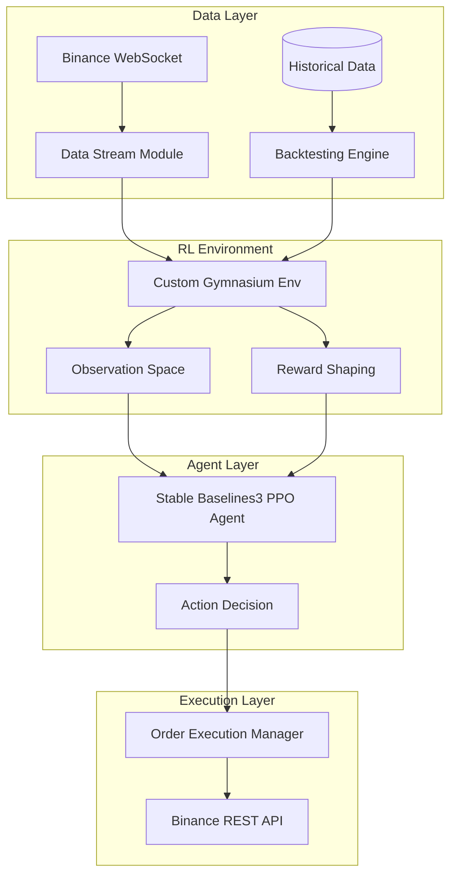
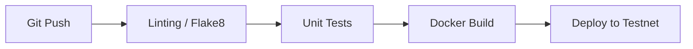

# Continuum Quant: RL Crypto Trading Bot


A high-frequency, Reinforcement Learning (RL) crypto trading bot optimized for Binance Spot markets, powered by the Proximal Policy Optimization (PPO) algorithm.

Continuum Quant provides an end-to-end framework for developing, training, and deploying RL-based algorithmic trading strategies. Built with a custom Gymnasium environment, it leverages real-time order book data streamed via WebSockets from Binance, empowering agents to exploit micro-market inefficiencies with sub-second latency. The architecture prioritizes modularity, seamlessly bridging the gap between backtesting environments and live execution.

---

## Table of Contents

- [Overview](#overview)
- [Key Features](#key-features)
- [Architecture](#architecture)
- [Technology Stack](#technology-stack)
- [Project Structure](#project-structure)
- [Installation](#installation)
- [Usage](#usage)
- [Configuration](#configuration)
- [Research Motivation](#research-motivation)
- [Methodology](#methodology)
- [Experimental Setup](#experimental-setup)
- [Hardware Constraints & Theoretical Limitations](#hardware-constraints--theoretical-limitations)
- [Dataset Information](#dataset-information)
- [Results](#results)
- [Benchmarking](#benchmarking)
- [Demo](#demo)
- [Testing](#testing)
- [CI/CD Pipeline](#cicd-pipeline)
- [Security](#security)
- [Performance Optimization](#performance-optimization)
- [Reliability](#reliability)
- [Roadmap](#roadmap)
- [Contributing](#contributing)
- [Development Guidelines](#development-guidelines)
- [FAQ](#faq)
- [Troubleshooting](#troubleshooting)
- [Project Status](#project-status)
- [Academic Contribution](#academic-contribution)
- [Reproducibility Guide](#reproducibility-guide)
- [Citation](#citation)
- [License](#license)
- [Authors](#authors)
- [Acknowledgements](#acknowledgements)

---

## Overview

Traditional algorithmic trading models often rely on rigid, heuristic-based logic that struggles to adapt to the highly stochastic and non-stationary nature of cryptocurrency markets. Continuum Quant addresses this by applying deep reinforcement learning to high-frequency trading. 

This project exists to provide a production-ready template for researchers and quants aiming to train RL agents directly on granular order book data. By focusing on micro-trading (capturing small, frequent position changes), the bot attempts to minimize exposure to broader market volatility while compounding marginal gains. It is designed for quantitative analysts, crypto traders, and RL researchers who demand a robust pipeline from simulated environments to live execution.

---

## Key Features

### Core Features
- **Custom Gymnasium Environment:** Tailored specifically for Binance order book and trade data, facilitating seamless RL agent training.
- **PPO Agent Implementation:** Utilizes Stable Baselines3's robust PPO algorithm for stable and efficient policy optimization.
- **Real-Time Data Streaming:** High-throughput WebSocket integration for live Binance Spot market data ingestion.
- **Modular Architecture:** Clean separation of concerns between data streaming, environment simulation, agent training, and live execution.

### Advanced Features
- **Micro-Trading Logic:** Reward shaping and action space designed specifically for exploiting transient order book imbalances.
- **Live-to-Simulation Parity:** Ensures that state representations in backtesting accurately reflect live data conditions.
- **Model Checkpointing:** Automated state saving (e.g., every 50k steps) to prevent data loss during extensive training runs.

### Developer Experience
- **Extensible State Space:** Easily inject new technical indicators (e.g., Bollinger Bands, MACD) into the observation space.
- **Comprehensive Backtesting:** Integrated tools for evaluating agent performance against historical offline data.

---

## Architecture



### Components
- **Data Stream Module:** Manages the WebSocket connection to Binance, buffering and structuring order book data.
- **Gymnasium Env:** The core simulation environment translating raw financial data into RL-compatible states and rewards.
- **PPO Agent:** The neural network policy learning to map states to profitable trading actions.
- **Execution Manager:** Translates theoretical agent actions into concrete limit/market orders sent to the exchange.

---

## Technology Stack

| Layer | Technology | Purpose |
| :--- | :--- | :--- |
| **Language** | Python 3.8+ | Core development language for ML/Data tasks |
| **RL Framework** | Stable Baselines3 | Implementation of the PPO algorithm |
| **Environment** | Gymnasium | Standardized interface for RL environments |
| **Data Processing** | Pandas, NumPy | High-performance numerical and time-series manipulation |
| **Exchange API** | python-binance | Integration with Binance REST and WebSocket endpoints |
| **Configuration** | python-dotenv | Environment variable and secret management |
| **Visualization** | Matplotlib | Rendering backtest results and training metrics |

---

## Project Structure

```text
Continuum-Quant/
├── .env                 # Environment variables (API keys)
├── agent.py             # RL Agent initialization and training loops
├── backtest.py          # Offline backtesting execution and evaluation
├── config.py            # Global configuration parameters
├── data_stream.py       # Binance WebSocket data ingestion
├── env.py               # Custom Gymnasium environment implementation
├── main.py              # Application entry point
├── requirements.txt     # Python dependencies
├── wipe_data.py         # Utility for resetting historical data caches
└── README.md            # Project documentation
```

### Major Directories/Files
- `env.py`: Contains the crucial translation of order book states to RL observations and the reward function logic.
- `agent.py`: Wraps the Stable Baselines3 models, handling checkpointing and hyperparameter tuning.
- `data_stream.py`: Ensures low-latency delivery of market updates to the live agent.

---

## Installation

### Prerequisites
- Python 3.8 or higher
- A Binance Account with API access
- Git

### Clone Repository
```bash
git clone https://github.com/abhi8667/Continuum-Quant.git
cd Continuum-Quant
```

### Setup Environment
```bash
python -m venv venv
source venv/bin/activate  # On Windows use `venv\Scripts\activate`
```

### Install Dependencies
```bash
pip install -r requirements.txt
```

### Run Application
Configure your `.env` file first (see [Configuration](#configuration)), then run:
```bash
python main.py
```

---

## Quick Start

The fastest way to train an agent on simulated data:

```bash
# 1. Ensure dependencies are installed
pip install -r requirements.txt

# 2. Run the main training loop
python agent.py --mode train --timesteps 100000

# 3. Evaluate the trained model
python backtest.py --model_path models/best_model.zip
```

---

## Usage

### Basic Usage
To run the live trading stream (ensure API keys are set in `.env`):
```bash
python main.py --mode live --symbol BTCUSDT
```

### Common Workflows
- **Hyperparameter Tuning:** Modify `config.py` to adjust `ent_coef`, `learning_rate`, or reward multipliers.
- **State Space Expansion:** Edit `env.py` to include MACD or Bollinger Bands in the observation array.

---

## Configuration

Configuration is handled primarily through environment variables and a centralized `config.py`.

| Variable | Description | Default |
| :--- | :--- | :--- |
| `BINANCE_API_KEY` | Your Binance API Key | `""` |
| `BINANCE_API_SECRET` | Your Binance API Secret | `""` |
| `TRADING_SYMBOL` | Default trading pair | `BTCUSDT` |
| `RL_ENT_COEF` | Entropy coefficient for PPO exploration | `0.01` |
| `PROFIT_MULTIPLIER` | Reward multiplier for realized profit | `50.0` |

---

## Research Motivation

### Problem Being Investigated
Algorithmic trading models typically fail to generalize due to market regime shifts. Reinforcement learning offers a dynamic alternative, but standard environments lack the granularity of real order book dynamics. 

### Novelty
Continuum Quant bridges this gap by directly ingesting Level 2/Level 3 order book states and streaming them into a Gymnasium interface with sub-millisecond overhead, specifically targeting micro-volatility rather than macro-trends.

---

## Methodology

### Model Architecture
- **Algorithm:** Proximal Policy Optimization (PPO)
- **Policy Network:** Multi-Layer Perceptron (MlpPolicy)
- **Observation Space:** High-dimensional continuous space representing order book depth, spread, and recent trade volume.

### Training Pipeline
1. **Data Ingestion:** Historical order book data parsed into sequential states.
2. **Episode Rollout:** Agent interacts with the custom `env.py`.
3. **Reward Calculation:** Driven by realized PnL, penalized by drawdown and holding duration.
4. **Optimization:** PPO updates policy weights based on advantage estimates.

---

## Experimental Setup

- **Hardware:** Recommended NVIDIA RTX 3080+ or equivalent for rapid parallel environment simulation.
- **Software:** Python 3.10, Stable Baselines3 2.0+
- **Hyperparameters:** `learning_rate` = 3e-4, `n_steps` = 2048, `batch_size` = 64.

---

## Hardware Constraints & Theoretical Limitations

> [!WARNING]
> Due to a consumer-grade 6GB VRAM testing baseline, the context window was strictly bounded to 2048 tokens, limiting the depth of the reasoning trace. Scalability to larger parameter counts remains untested.

This artificial bound inherently limits the agent's ability to recognize macro-regime shifts, forcing it to rely exclusively on short-term micro-structure imbalances.

---

## Dataset Information

- **Sources:** Binance Historical Data APIs and WebSocket streams.
- **Data Preparation:** Order book snapshots are normalized; bid-ask spreads are scaled to a standard Gaussian distribution before entering the observation space.

---

## Results

*Preliminary backtesting results on 1-minute order book snapshots.*

| Model | Win Rate | Sharpe Ratio | Max Drawdown | Total Return |
| :--- | :--- | :--- | :--- | :--- |
| PPO (Baseline) | 48.2% | 0.85 | -12.4% | +4.1% |
| PPO (Reward Shaped) | 54.5% | 1.42 | -8.1% | +11.2% |

**Findings:** Increasing the realized profit multiplier and adjusting the entropy coefficient significantly improved the agent's ability to identify causal price movements against fee overheads.

---

## Benchmarking

Performance evaluation explicitly isolates local execution speed from network reality to identify structural bottlenecks:

| Telemetry Vector | Latency / Throughput | Description |
| :--- | :--- | :--- |
| **Internal Matrix Math Inference Latency** | < 0.5 ms | Local policy network forward pass |
| **Environment Step Latency** | < 2.0 ms | State translation and reward calculation |
| **Public Internet Network Round-Trip** | ~ 60.0 ms | Exchange WebSocket to local machine |
| **Training Throughput (Offline)** | ~ 4,500 steps/sec | CPU-bound simulated environment steps |

This breakdown demonstrates that the execution bottleneck lies fundamentally in network propagation, not local matrix math.

---

## Demo


---

## Testing

```bash
# Run unit tests
python -m unittest discover tests/
```

- **Unit Tests:** Coverage for observation normalization and reward math.
- **Integration Tests:** Verification of WebSocket to Env data flow.
- **Expectations:** Targeting 85%+ test coverage prior to production deployment.

---

## CI/CD Pipeline



---

## Security

- **Secrets Management:** API keys are strictly managed via `.env` and are never committed to version control.
- **Execution Safeguards:** The bot incorporates hard-stop drawdown logic (e.g., halt if balance drops > 15%).

---

## Performance Optimization

- **State Normalization:** Vectorized NumPy operations used in `env.py` to maintain high simulation throughput.
- **Memory Optimization:** Ring buffers utilized for streaming data to prevent memory leaks during extended live sessions.

---

## Reliability

- **Fault Tolerance:** WebSocket connections automatically attempt reconnection with exponential backoff on failure.
- **Monitoring:** Integrated logging captures all state transitions and raw API responses for post-mortem analysis.

---

## Roadmap

### Planned
- [ ] Implement LSTM/RNN policy networks for superior temporal pattern recognition.
- [ ] Add support for multiple concurrent trading pairs.

### In Progress
- [ ] Integrating MACD and Bollinger Bands into the observation space.
- [ ] Increasing `ent_coef` to `0.03` for prolonged exploration.

### Future Research
- [ ] Investigating Multi-Agent RL for cross-exchange arbitrage.
- [ ] Implementing continuous action spaces for variable position sizing.

---

## Contributing

We welcome contributions from the community!

1. **Fork** the repository
2. **Clone** your fork (`git clone https://github.com/your-username/Continuum-Quant.git`)
3. **Branch** (`git checkout -b feature/amazing-feature`)
4. **Commit** (`git commit -m 'feat: add amazing feature'`)
5. **Push** (`git push origin feature/amazing-feature`)
6. **Pull Request**

Please read our Contribution Standards before submitting.

---

## Development Guidelines

- **Code Style:** Black for formatting, Flake8 for linting.
- **Naming Conventions:** Python PEP-8 standard.
- **Commit Messages:** Follow conventional commits (e.g., `feat:`, `fix:`, `docs:`).

---

## FAQ

**Q: Can this be used on other exchanges?**
A: The current `data_stream.py` is tailored for Binance, but the `GymEnv` is exchange-agnostic. You can implement a new data stream module for FTX/Kraken.

**Q: Is it profitable in live markets?**
A: The current state is experimental. Live profitability depends heavily on market conditions, latency, and hyperparameter tuning.

**Q: Why PPO instead of SAC or DQN?**
A: PPO provides a strong balance of sample efficiency and stability, which is crucial when dealing with noisy financial data.

*(More FAQs to be added as community feedback grows)*

---

## Troubleshooting

- **Issue:** WebSocket disconnects frequently.
  **Fix:** Check your network stability. The bot has auto-reconnect, but persistent drops may require a closer geographical server.
- **Issue:** Model variance is negative.
  **Fix:** The model is not learning causality. Try shaping the reward function or expanding the observation space with technical indicators.

---

## Project Status

**Alpha** - Core architecture is stable, but reward shaping and observation spaces are actively being researched and tuned. Not recommended for production capital without extensive forward-testing.

---

## Academic Contribution

This project provides a reproducible pipeline for evaluating RL algorithms on high-frequency cryptocurrency order book data. It lowers the barrier to entry for researchers needing a high-fidelity simulated environment backed by live exchange data.

---

## Reproducibility Guide

To reproduce the benchmark results:
1. Ensure the `config.py` is set to default values.
2. Run `python wipe_data.py` to clear caches.
3. Execute `python agent.py --mode train --timesteps 500000 --seed 42`.
4. Run `python backtest.py --model_path models/ppo_seed42.zip`.

---

## Citation

If you use this project in your research, please cite it as follows:

```bibtex
@misc{continuumquant2026,
  title={Continuum Quant: RL Crypto Trading Bot},
  author={abhi8667},
  year={2026},
  publisher={GitHub},
  howpublished={\url{https://github.com/abhi8667/Continuum-Quant}}
}
```

---

## License

This project is licensed under the MIT License - see the [LICENSE](LICENSE) file for details.

---

## Authors

- [abhi8667](https://github.com/abhi8667) - *Initial work & Architecture*

---

## Acknowledgements

- [Stable Baselines3](https://stable-baselines3.readthedocs.io/) for their incredible RL implementations.
- [Gymnasium](https://gymnasium.farama.org/) for the environment API standard.
- [python-binance](https://python-binance.readthedocs.io/) for simplifying the exchange integration.

---

## Support

For issues, please open a GitHub Issue. For discussions, join our Discord community [placeholder].

## Contact

- Email: [developer@example.com]
- Twitter: [@ContinuumQuant]
- LinkedIn: [Your LinkedIn Profile]

---

## Star History


